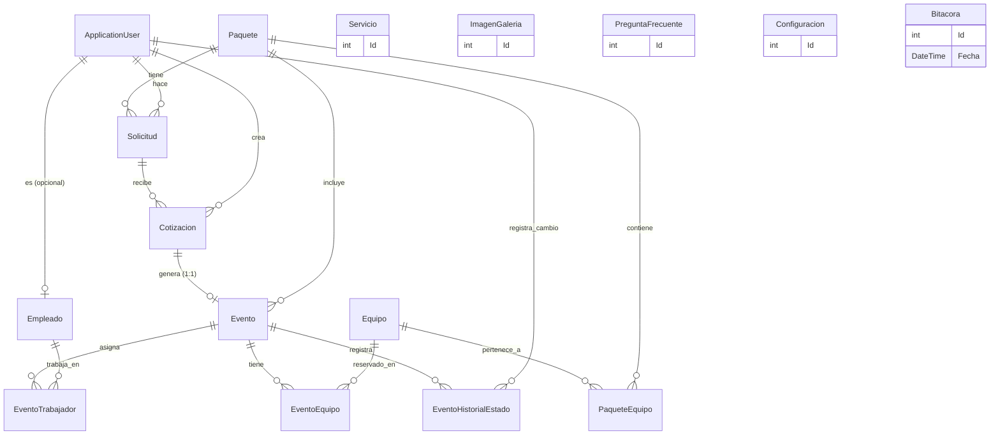

# Diagrama de Base de Datos - ProjectSaborLatino

Aquí tienes la radiografía de tu base de datos (y recemos para que esos borrados en cascada no te den un dolor de cabeza en producción).

```mermaid
erDiagram
    %% Usuarios y Empleados
    ApplicationUser ||--o{ Solicitud : "hace"
    ApplicationUser ||--o{ Cotizacion : "crea"
    ApplicationUser ||--o| Empleado : "es (opcional)"
    ApplicationUser ||--o{ EventoHistorialEstado : "registra_cambio"

    Empleado ||--o{ EventoTrabajador : "trabaja_en"

    %% Catálogo
    Paquete ||--o{ Solicitud : "tiene"
    Paquete ||--o{ Evento : "incluye"
    Paquete ||--o{ PaqueteEquipo : "contiene"

    Equipo ||--o{ PaqueteEquipo : "pertenece_a"
    Equipo ||--o{ EventoEquipo : "reservado_en"

    %% Solicitudes y Cotizaciones
    Solicitud ||--o{ Cotizacion : "recibe"
    Cotizacion ||--o| Evento : "genera (1:1)"

    %% Eventos
    Evento ||--o{ EventoEquipo : "tiene"
    Evento ||--o{ EventoTrabajador : "asigna"
    Evento ||--o{ EventoHistorialEstado : "registra"

    %% Tablas independientes (Sin relaciones directas en FluentAPI con navegación)
    Servicio {
        int Id
    }
    ImagenGaleria {
        int Id
    }
    PreguntaFrecuente {
        int Id
    }
    Configuracion {
        int Id
    }
    Bitacora {
        int Id
        DateTime Fecha
    }
```
